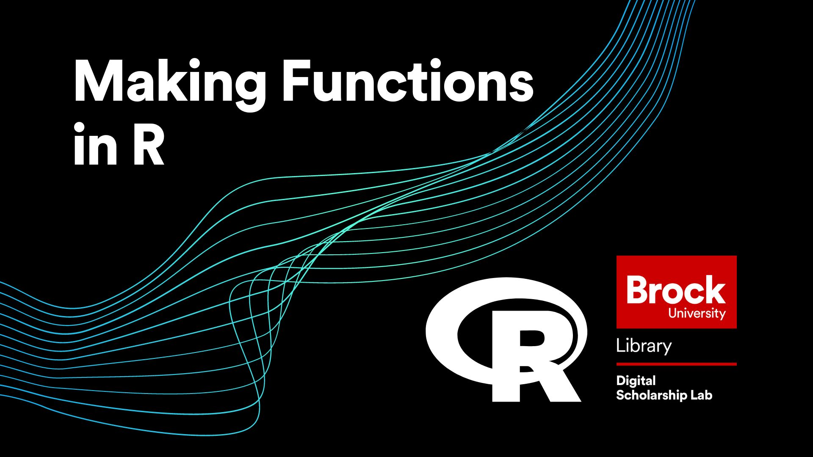
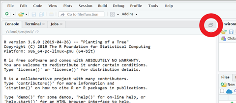

# Making Functions in R
In this workshop you will get begin developing in R to the point that you can start crafting the tools that you need for the projects that are important to you. This workshop will cover:
 - If statements and conditionals
 - Three different kinds of Loops
 - And creating your own functions

*Estimated workshop length: 2 hours*

----
## Setup Instructions
In preparation for this workshop, you will need to have an R Studio Cloud account and have a new project open.  Follow the steps below to get set up.

- (Skip this step if you already have an R Studio Cloud account) Begin by going to [https://rstudio.cloud/](https://rstudio.cloud/) and signing up for an account by clicking on the "Sign Up" text at the top right of the screen, then click the grey "Sign Up" button and fill in the form (or use the convenient Google or GitHub options if you have one of those accounts)
- Log in to R Studio Cloud
- You should arrive at your workspace.  From here click on the button that says, "New Project" and select "New R Studio Project"
- Once your project has finished building, open the "Source" window by clicking on the double box symbol in the top right corner of the "Console" window



 - Rename your project by clicking on the name at the top.  Name it whatever you like (eg. "Making Function with R Workshop")


 - And thats it!  You are all set for the workshop

----
## Helpful Information

**Conditional Statement Symbols**  
  
| Symbol | Description |
|----|-------------|
| == | Is equal to |
| != | Is not equal to |
| < |	Is less than |
| <=	| Is less than or equal to |
| >	| Is greater than |
| >= |	Is greater than or equal to|


**Format of "if" statement**
```R 

if (CONDITIONAL-STATEMENT) {
    CODE-TO-EXECUTE
    } else if (CONDITIONAL-STATEMENT) {
    CODE-TO-EXECUTE
    } else {
    CODE-TO-EXECUTE
    }
  
```

**Format of "for" loop**
```R 
for (NEW-VARIABLE in VECTOR) {
    CODE-TO-EXECUTE
    }
```
**Format of  "while" loop**
```R 
while (CONDITIONAL-STATEMENT) {
    CODE-TO-EXECUTE
}
```
**Format of "repeat" loop**
```R 
repeat {
    CODE-TO-EXECUTE  (REMEMBER TO INCLUDE A break() TO STOP THE LOOP)
}
```
**Format for Function**
```R 
FUNCTION-NAME <- function(ARGUMENT-VARIABLE-1, ARGUMENT-VARIABLE-2, …) {
return(OUTPUT-OF-FUNCTION)
}
```

----
## Workshop Tasks

**Task Set #1**  
A. Create a variable that contains a number  
B. Create some code that assesses the number and returns one of the following statements:  
 - The number is larger than or equal to 1000
 - The number is larger than or equal to 500 but less than 1000
 - The number is larger than or equal to 100 but less than 500
 - The number is 14
 - The number is less than 100 and is not 14  
  
C. Test out your code by redeclaring your variable with values that will get each result and then running your code again.  
D. When you are done type “CODE COMPLETE!!” into the chat.  

  
**Task Set #2**  

A. Make a variable called numList that contains a list of 10 numbers of your choice using the c() function  
B. Write a for loop that runs your code from the last set of questions on each number in the list.  
C. Make a numLoops variable that has a value of 0  
D. Make a numBig variable with a value over 100,000  
E. Use a while loop to determine how many times you can subtract 14 from your number before it is smaller than 100  
F. Make a variable called myNum with a value that is at least 6 digits long  
G. Make a variable called loopGuess with a value of 0  
H. Find out how long it would take for a repeat loop to go from 0 to your number  
I. When you are done type “LOOPS MASTERED!!!” into the chat   

  
**Task Set #3**  

A. Make a variable called myList containing ten numbers between 50 and 150  
B. Make a function that, when given the variable, will tell you how many of the numbers smaller than 100 and how many are equal to or greater than 100.  
C. When you have finished type “GOT IT!!” in the chat  
BONUS. Make it so that if there is the same amount of numbers below 100 as there are equal to or above, the result is displayed with “Perfect Balance!” at the end  


----
## Next Steps
If you are looking to continue enhancing your knowledge of R, check out our other R workshops or try out one of the options below!

[YaRrr! The Pirate's Guide to R](https://bookdown.org/ndphillips/YaRrr/)   
  
[W3Schools R Tutorial](https://www.w3schools.com/r/default.asp)
  
   
----
  
**This workshop is brought to you by the Brock University Digital Scholarship Lab.  For a listing of our upcoming workshops go to [Experience BU](https://experiencebu.brocku.ca/organization/dsl) if you are a Brock affiliate or [Eventbrite page](https://www.eventbrite.ca/o/brock-university-digital-scholarship-lab-21661627350) for external attendees.**

